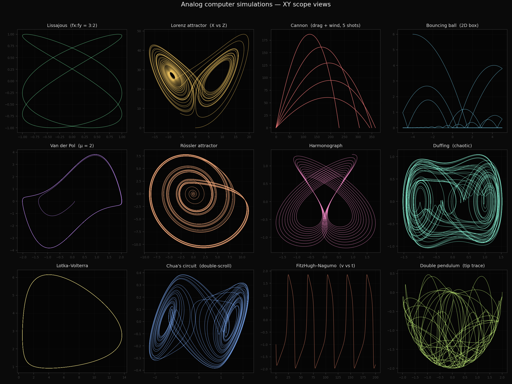
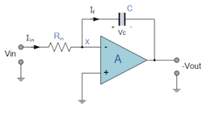
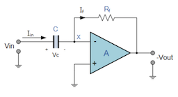
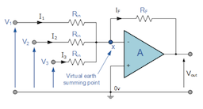
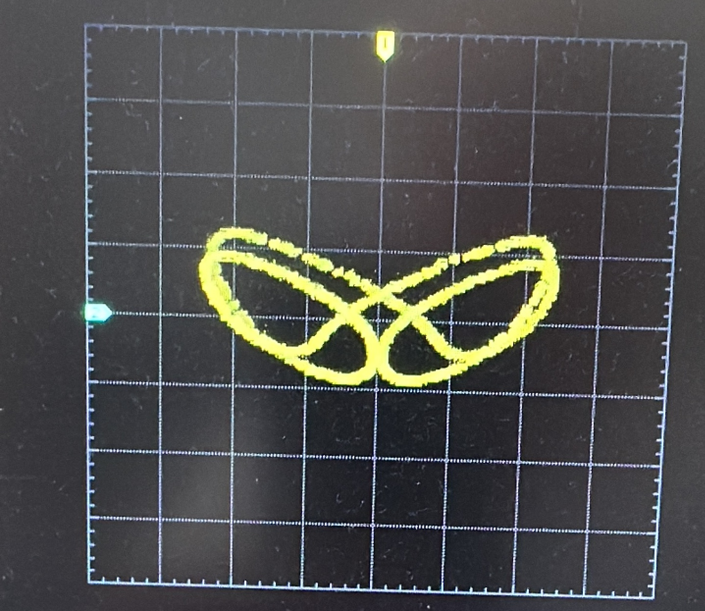

# Analog Computers
An analog computer was one of the first computers used to simulate dynamic processes, such as a cannonball firing or a bouncing ball, breathing of a heart, etc.

Unlike a discrete system (a digital computer), an analog computer builds a continuous system using specialized computing elements:

- Potentiometer (Potmeter) for setting a constant value.
- Comparator to check a threshold.
- Summing Amplifier to add signals together.
- Integrator & Differentiator for continuous mathematical operations.
- Absolute Value is a diode as used for rectification.
- Multipliers to multiply continuous variables.

It sure look like Op-Amp's everywhere...

### Integrator

### Differentiator

### Summing Amplifier

Learn more at [electronic tutorials](https://www.electronics-tutorials.ws/opamp/opamp_6.html) from where the circuits above were captured.

## Analog Computer Experiments
Building one is always on my mind, but before I do some experiments first. Here an example of a lorenz attractor as displayed on my oscilloscope.

## Python Simulator
It is amzingly simple to let AI generate some code that makes it easy to try out ideas. Also, in this case the simulator was build by Claude AI after a long session of what I wanted. It is amazing to see how fast an idea can be tested. However, careful checking of the code is required, things like robustness, correctness and technical debt keep me worried.

### Sample Simulations
The simulator uses micropython code and is used on a STM32 MCU. However, micropython implementation has enough hardware abstraction that almost any board will work.

For a setpoint (potentiometer) an analog input (`PA0`, `PA1`, `PA2`) are used. Two DACs are used for an X and Y channel (`PA4`, `PA5`).

For all the different analog simulations that with real hardware would be constructed through patching wires from and to analog elements from the list above.

#### `lissajous_patch`
Set two freqencies, select `sine` oscillator for both, output both oscillators to XY-display.

### `lorenz_patch`

A nice article from Harvard is this [lorenz attractor](https://seti.harvard.edu/unusual_stuff/misc/lorenz.htm) in hardware. Much of how an analog computer looks like.

### `cannon_patch`
Quadratic-drag ballistics with wind.

It uses three potentiometers: PA0 = launch angle, PA1 = muzzle velocity, PA2 = wind.

### `bouncing_ball_patch`
2D ball in a box.

Use potentiometer PA0 to set the  coefficient of restitution.

### `van_der_pol_patch`

xdot = y, ydot = mu(1-x^2)y - x  limit cycle.

### `rossler_patch`
Scaled Rossler attractor.

### `harmonograph_patch`
Sum of damped sines per axis.

Potensiometer PA0..PA2 tune frequencies.
  
### `lunar_lander_patch`
1D descent using potentiometer A0 = thrust (0..T_max).

`h = altitude`, `v = velocity (down = -)`, `m = mass`, `hdot = v`, `vdot = -g + T/m`, `mdot = -T/(g0*Isp)`

Scope output:
- X = fuel remaining (m)
- Y = altitude (h)

__

**Disclaimer:** _I'm not an expert in this field so, much of what you will find here is not necessarily created by myself. In such cases the sources will be mentioned._

